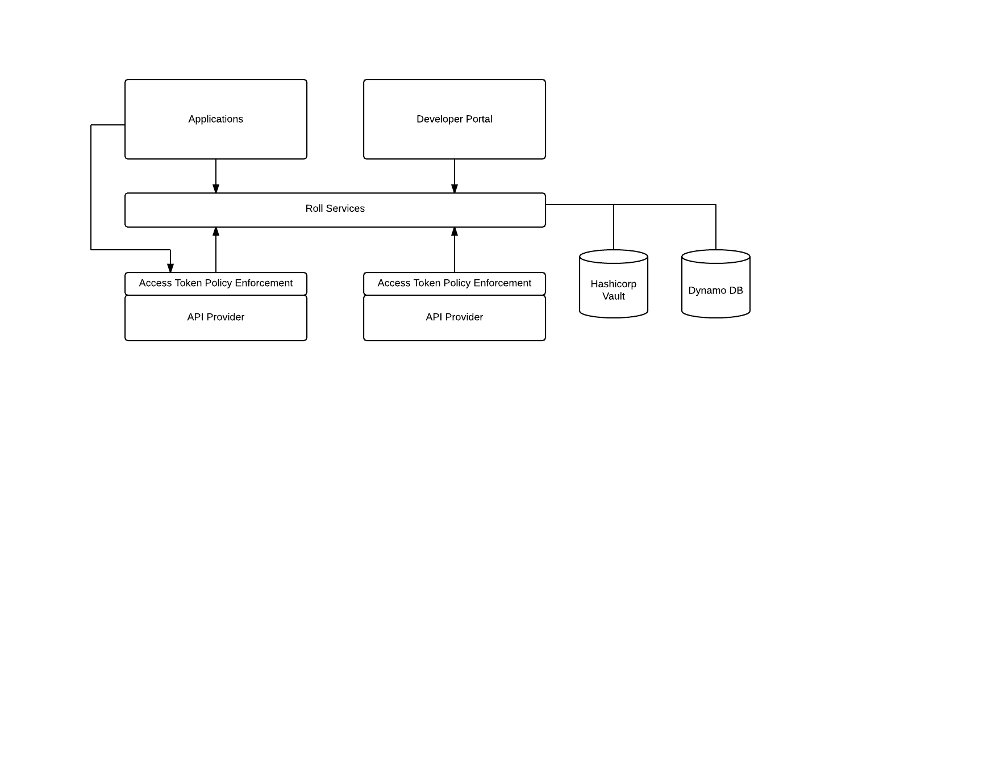

# Roll Design Notes

Roll is a project that provides some basic functionality for registering developers
and applications in a developer portal, for registered applications to obtain
access tokens for making API calls, and for environments providing API services to
grant access only to applications that have obtained access tokens.

These notes will talk about the use of this software in the context of the XTRAC development
portal and APIs, but the Roll project is general enough for reuse in a variety of contexts.

## Overview

As part of our UI and API strategies, XTRAC will be building a developer portal for consumers of
UI components and APIs. The scope of this document is to discuss application registration and
access from the viewpoint of the API project.

From the API perspective, we want to create a developer portal to make it easy for developers
to create applications that integrate with XTRAC through our API set. Such as portal provides
the following:

* A simple mechanism to register as an XTRAC developer and obtain instant access to an
environment that can be used to experiment with API calls.
* The ability to register XTRAC applications and obtain an API key and API secret for the
application.
* An interactive quick start guide that introduces the developer to XTRAC workflow as
experienced via the API.
* Live API reference documentation that enables developers to form and execute API calls
from the documentation.
* Full documentation that includes best practices, reference architectures and code, and
task-oriented guides that help developers achieve certain classes of activities, such as
building web and mobile applications, integrating line of business systems with XTRAC,
and submitting XTRAC transactions on behalf of others.
* Access to a collaboration platform to connect developers to each other to facilitate
building a community of XTRAC developers.

The scope of this document is to discuss:

* Services for registering developers and applications.
* Mechanisms for registered applications to obtain access tokens.
* Mechanisms for protecting API endpoints to restrict access to callers who have valid access 
tokens.

The following diagram shows the roll system context.

Roll provides services for registering developers and applications, for obtaining access tokens, 
and for validating access tokens. Roll is designed such that a single instance of the application can be used
for multiple API provider instances and tenants.

The developer portal uses services for managing developer and application registration.

Applications use roll services for obtaining access tokens for API access. Access to applications are
through access token policy enforcement points, which ensure a valid access token is present in API
requests, and optionally granting access only to white-listed applications.

The access token policy enforcement points use roll services to access information needed to validate tokens.

Currently, developer and application data is stored in AWS's [Dynamo DB](https://aws.amazon.com/dynamodb). 
DynamoDB is a fully managed cloud database
for applications that need consistent, low latency access to data at any scale. DynamoDB supports both
document and key-value store models.

The generation and validation of access tokens requires the generation and use of private key/public key pairs. 
These key pairs are used only by the Roll application and are never shared with applications. Sincce these key
pairs essentially represent the keys to the kingdom, so to speak, their storage and management is a 
critical security access.

[Hashicorp Vault](https://www.vaultproject.io/) is used securely store and manage these keys. Vault is a specialized 
piece of software used for managing secrets, designed with managing access tokens, passwords, certificates, and 
API keys. It handles leasing, key revocation and rolling, and auditing, and can be configured to use 
different backends, including HSMs and others.   

## Users and Applications

Roll stores two classes of information: Developers and Applications.

Currently, developer data is minimal: developer's first name, last name, and email address. We store minimal developer 
information to allow rapid registration with the portal, similar to signing up with provider's like Auth0, Twilio, etc.

Associated with a Developer are one or more applications. For each application, in DynamoDB we store the following:

* Developer Email - Used to link an application to a developer responsible for the application.
* API Key - Used as an identifier for the API. This is non-sensitive data in the scenarios covered in this document.
* Application Name - Name of the application.
* Redirect URI - Used in the OAuth2 web application and implicit grant flows.
* JWTFlow Public Key - Used to verify signed JWT tokens in the OAuth2 JWT flow.
* Login Provider URL - Service URL used to authenticate users in the OAuth2 web application and implicit grant flows.

Additionally, in Vault we store:

* API Secret - essentially a password generated by Roll for use by the API.
* Public and private keys used to validate and sign access tokens.

### Current Service Set, Users and Applications

* GET and PUT on /v1/applications/{api key}
* GET and PUT on /v1/developers/{dev email}

## Obtaining Access Tokens

The following mechanisms are currently supported for obtaining access tokens.

* OAuth2 Authorization Code Grant
* OAuth2 Implicit Grant
* OAuth2 Resource Owner Password Credentials Grant
* JSON Web Token (JWT) Grant

### OAuth2 Authorization Code Grant

There are 4 players in the authorization code grant:

1. The user agent
2. The auth server (Roll)
3. The login provider
4. The web server

This flow begins with the user agent loading a login page from the authz server

### OAuth2 Implicit Grant

### OAuth2 Resource Owner Password Credentials Grant

### JSON Web Token (JWT) Grant

## Quality Attribute Considerations

### Security

### Performance and Scale

### Portability

### Standards Compliance

 