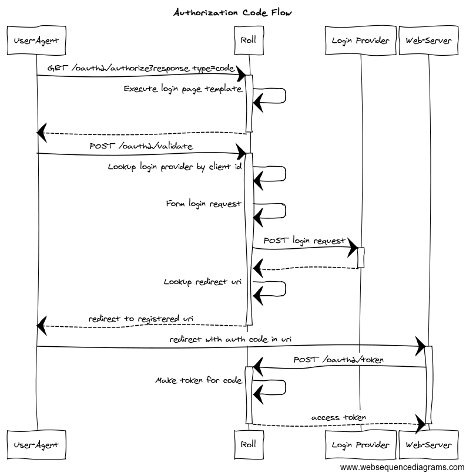
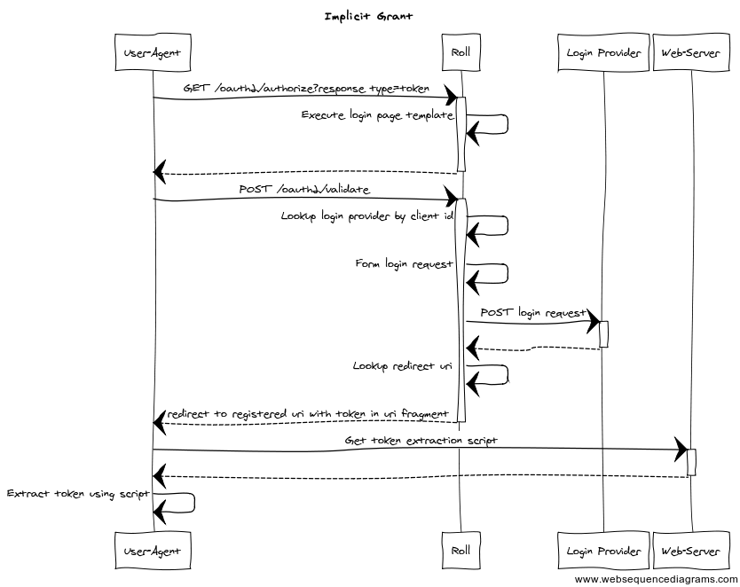
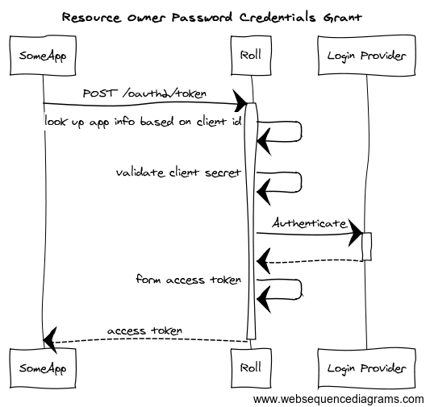
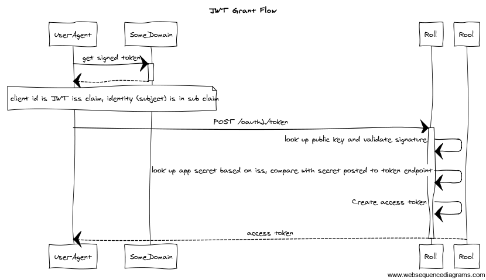

# Roll Design Notes

Roll is a project that provides some basic functionality for registering developers
and applications in a developer portal, for registered applications to obtain
access tokens for making API calls, and for environments providing API services to
grant access only to applications that have obtained access tokens.

These notes will talk about the use of this software in the context of the XTRAC development
portal and APIs, but the Roll project is general enough for reuse in a variety of contexts.

## Overview

As part of our UI and API strategies, XTRAC is building a developer portal for consumers of
UI components and APIs. The scope of this document is to discuss application registration and
access from the viewpoint of the API project.

From the API perspective, we want to create a developer portal to make it easy for developers
to create applications that integrate with XTRAC through our API set. Such as portal provides
the following:

* A simple mechanism to register as an XTRAC developer and obtain instant access to an
environment that can be used to experiment with API calls.
* The ability to register XTRAC applications and obtain an API key and API secret for the
application.
* An interactive quick start guide that introduces the developer to XTRAC workflow as
experienced via the API.
* Live API reference documentation that enables developers to form and execute API calls
from the documentation.
* Full documentation that includes best practices, reference architectures and code, and
task-oriented guides that help developers achieve certain classes of activities, such as
building web and mobile applications, integrating line of business systems with XTRAC,
and submitting XTRAC transactions on behalf of others.
* Access to a collaboration platform to connect developers to each other to facilitate
building a community of XTRAC developers.

The scope of this document is to discuss:

* Services for registering developers and applications.
* Mechanisms for registered applications to obtain access tokens.
* Mechanisms for protecting API endpoints to restrict access to callers who have valid access 
tokens.

The following diagram shows the roll system context.

Roll provides services for registering developers and applications, for obtaining access tokens, 
and for validating access tokens. Roll is designed such that a single instance of the application can be used
for multiple API provider instances and tenants.

The developer portal uses services for managing developer and application registration.

Applications use roll services for obtaining access tokens for API access. Access to applications is
through access token policy enforcement points, which ensure a valid access token is present in API
requests, and optionally granting access only to white-listed applications.

The access token policy enforcement points use roll services to access information needed to validate tokens.

Currently, developer and application data is stored in AWS's [Dynamo DB](https://aws.amazon.com/dynamodb). 
DynamoDB is a fully managed cloud database
for applications that need consistent, low latency access to data at any scale. DynamoDB supports both
document and key-value store models.

The generation and validation of access tokens requires the generation and use of private key/public key pairs. 
These key pairs are used only by the Roll application and are never shared with applications. Sincce these key
pairs essentially represent the keys to the kingdom, so to speak, their storage and management is a 
critical security access.

[Hashicorp Vault](https://www.vaultproject.io/) is used securely store and manage these keys. Vault is a specialized 
piece of software used for managing secrets, designed with managing access tokens, passwords, certificates, and 
API keys. It handles leasing, key revocation and rolling, and auditing, and can be configured to use 
different backends, including HSMs and others.   

## Users and Applications

Roll stores two classes of information: Developers and Applications.

Currently, developer data is minimal: developer's first name, last name, and email address. We store minimal developer 
information to allow rapid registration with the portal, similar to signing up with provider's like Auth0, Twilio, etc.

Associated with a Developer are one or more applications. For each application, in DynamoDB we store the following:

* Developer Email - Used to link an application to a developer responsible for the application.
* API Key - Used as an identifier for the API. This is non-sensitive data in the scenarios covered in this document.
* Application Name - Name of the application.
* Redirect URI - Used in the OAuth2 web application and implicit grant flows.
* JWTFlow Public Key - Used to verify signed JWT tokens in the OAuth2 JWT flow.
* Login Provider URL - Service URL used to authenticate users in the OAuth2 web application and implicit grant flows.

Additionally, in Vault we store:

* API Secret - essentially a password generated by Roll for use by the API.
* Public and private keys used to validate and sign access tokens.

### Current Service Set: Users and Applications

* GET and PUT on /v1/applications/{api key}
* GET and PUT on /v1/developers/{dev email}
* POST on /v1/jwtflowcerts/{api-key}

## Obtaining Access Tokens

The following mechanisms are currently supported for obtaining access tokens.

* OAuth2 Authorization Code Grant
* OAuth2 Implicit Grant
* OAuth2 Resource Owner Password Credentials Grant
* JSON Web Token (JWT) Grant

### A Note on Terminology

Currently, among other things we store an API Key and API Secret for each application. These are are
synonymous with Client ID and Client Secret in OAuth2 nomenclature. 

### OAuth2 Authorization Code Grant

This flow begins with the user agent loading a login page from the authz server via a GET 
on the `/oauth2/authorize` endpoint. The page is currently a template where the application name
and client_id are plugged in when the page is rendered from the template. Future enhancements might
include loading a page customized for the application that is looked up at render time. The response_type
for this flow is code.

The login form allows user credentials to be entered, and provides allow and deny buttons on a page that
asks for access to the users's data. If the allow button is pressed, when the form data is submitted
to the `/oauth2/validate` endpoint, Roll looks up the application information associated with the 
client_id, which includes the login provider URL and the redirect URI.

The Roll framework uses URL schemes to determine how to process a login request. Currently, an xtrac method is
provided, with the form being xtrac://host:port. For this login method, we form a login soap request with the
username and password, and POST it to the login service URI on the host indicated in the login provider URL.

If the login method indicates success, Roll creates an authorization code and includes it in the redirect to the 
redirect URI obtained from the application lookup. The authorization code is encoded as a JWT, with a nonce to
prevent replay attacks and a short expiration time to limit the duration in which the code can be used to 
obtain an access token.

When the user agent redirects to the web server registered via the redirect URI associated with the application, the 
server the request was redirected to POSTs to the `/oauth2/token` endpoint. The POST includes the client secret: Roll validates 
the access code was signed with the application's private key (known only to Roll) and checks that the 
secret submitted in the POST matches that registered for the application.
 
If the validation checks out, and access token is formed, and returned in the body of the response to the POST from
the web server.

### OAuth2 Implicit Grant

The implicit grant flow is used by browser and mobile applications that cannot keep secrets. These are the 
types of applications where it would not be appropriate to store and use the client secret associated with the 
application.

This flow begins with the user agent loading a login page from the Roll server via a GET 
on the `/oauth2/authorize` endpoint. The page is currently a template where the application name
and client_id are plugged in when the page is rendered from the template. The response_type for
this flow is token.

The login form allows user credentials to be entered, and provides allow and deny buttons on a page that
asks for access to the users's data. If the allow button is pressed, when the form data is submitted
to the `/oauth2/validate` endpoint, Roll looks up the application information associated with the 
client_id, which includes the login provider URL and the redirect URI.

The Roll framework uses URL schemes to determine how to process a login request. If the login method indicates success, 
Roll creates a JWT access token signed with the private key associated with the application, and embeds it in
a fragment appended to the redirect URI that was obtained for the application as part of the application lookup by
client_id.

The redirect URI should go to a web server to load a script that runs in the user agent to extract the access
token from the fragment in the redirect URI.

Once the user agent extracts the token, it should call the token validation service
to ensure the token embedded in the fragment is a valid access token created 
by Roll (token validation service coming soon).

### OAuth2 Resource Owner Password Credentials Grant

The resource owner password credentials grant can be used by trusted applications that can keep
secrets and obtain user credentials.

In this flow, the clients POSTs user and applications credentials to the `/oauth2/token` endpoint. Roll validates the
application credentials, then executes the login method associated with the application using the supplied
user credentials. If the login succeeds, Roll creates a JWT for the application, and signs it with the application's 
private key, returning the token in the response.

### JSON Web Token (JWT) Grant

The JWT grant is used where authentication can be delegated to another realm, and a JWT produced in the trusted
realm can be used to obtain a token from Roll.

An additional set up requirement for this flow is loading the cert used to validate the token from the external
realm for the application that will used the JWT flow. Roll extracts the public key from the cert for use in 
validating the token signature before issuing a JWT from Roll's realm.

Assuming the above set up, the flow starts with the user agent POSTing to the `/oauth2/token` endpoint. The POSTed
request includes the JWT to use in obtaining an access token.

Roll assumes the API key is stored in the JWT in the iss claim field. The public key for validating the signature
is looked up using the API key.

If the signature checks out, the client secret sent in the POST request is compared against the client secret 
stored for the application. If all checks out, an access token is created by Roll and signed with the private key
associated with the application, then returned to the called.

### Endpoint Protection

The authzwrapper package includes a golang http handler decorator that extract the JWT bearer token from the
request and validates the signature before allowing the access to go through. 

The echo package includes an example server protected by the authzwrapper. Wrapping the handler is simple:

<pre>

import az "github.com/xtraclabs/roll/authzwrapper"

mux := http.NewServeMux()
mux.Handle("/echo", az.Wrap(echoHandler()))

</pre>

## Quality Attribute Considerations

### Security

* Given the use of secrets in this application (private keys, client secrets), secure storage of secrets is 
a major concern. Towards this end, Vault is used for secrets management; additional details like what backend
to use and other concerns will be addressed as the design work progresses.
* Currently, non-secured endpoints are using used. This is an application where TLS should be used everywhere; the
project should be updated accordingly
* A token validation service will be added to avoid the [confused deputy](https://en.wikipedia.org/wiki/Confused_deputy_problem) problem.
* Access codes and tokens will embed expiration times.
* Given there's no central storage of in use tokens to track which are active and valid, a 
[token blacklisting service](https://auth0.com/blog/2015/03/10/blacklist-json-web-token-api-keys/)
is needed to revoke token if they are stolen.
* More design is needed around ACLs for the various components that access the secrets vault.

### Performance and Scale

Using digital signatures and JWT allows us to provide a secure token management solution that is decentralized,
which will help scale up access checks. Additionally, using expiration times for tokens will limit the amount
of data that might need to be cached for token blacklisting.

### Portability

This software is intended to be released as open source. Technology choices will be made to favor technologies
likely to be adopted by open source developers, as opposed to biasing the technology selection towards legacy
vendor stacks.

### Standards Compliance

This software should adhere as closely as possible to the OAuth2 specification.

 